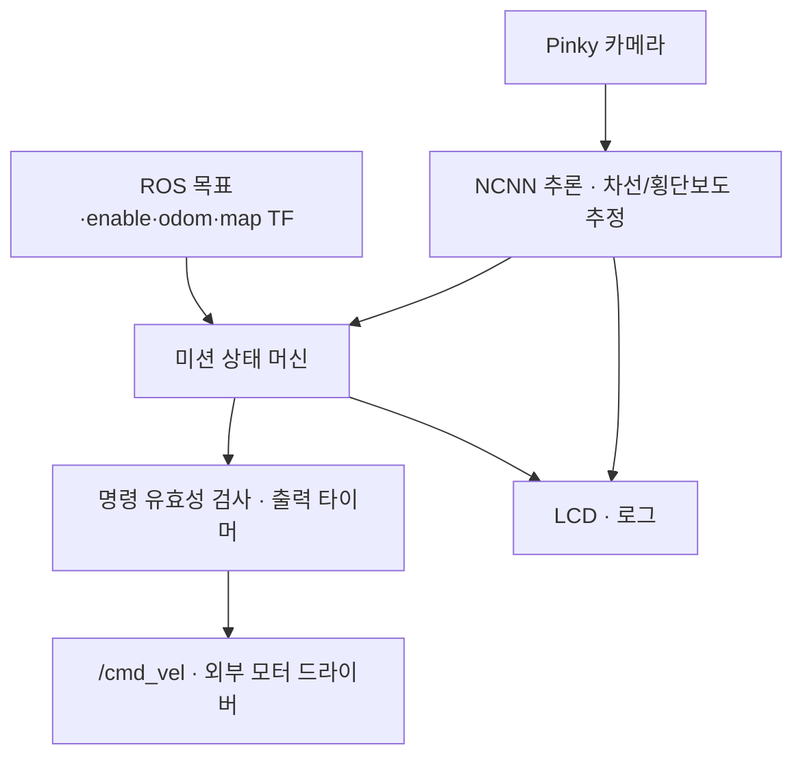

# Pinky 비전 기반 차선 추종 및 교차로 미션 제어

발표용 기능명세서 및 실행 가이드 · 2026-10-06

## 1. 프로젝트 개요

카메라 영상에서 차선과 횡단보도를 인식하고, 로봇 내부에서 조향과 속도를 계산하는 ROS 2 기반 주행 프로그램이다. 일반 구간에서는 차선 중심을 추종하고, 교차로 후보에서는 지도 좌표상의 목표 방향을 보고 직진 또는 회전을 선택한다.

핵심 구성은 **YOLO segmentation + 차선 중심 추정 + PD 조향 + 상태 머신 + odom 상대 이동 제어**다. NCNN 모델 추론과 주행 판단은 Pinky 내부에서 수행한다. 노트북은 파일 전송, SSH 실행, GUI 명령 및 로그 확인에 사용한다.

현재 코드는 지도 전체의 경로를 계획하는 자율 내비게이션이 아니다. Nav2 planner/controller를 호출하지 않으며, 지도 기반 위치 추정은 외부 map_server·AMCL 및 TF 구성에 의존한다.

## 2. 목표와 범위

| 항목 | 현재 구현 범위 |
|---|---|
| 차선 추종 | 좌·우 차선 마스크로 중심 추정, PD 조향, 속도 조절 |
| 단일 차선 대응 | 다른 차선이 없으면 추정 차선 폭으로 중심 보완 |
| 교차로 후보 검출 | 횡단보도 면적과 연속 검출 횟수로 이벤트 확정 |
| 방향 선택 | map 좌표의 현재 위치·자세와 목표 x,y로 상대 방향 계산 |
| 교차로 진입·회전 | odom으로 진입 거리 및 회전각 확인 |
| 도착 | 목표 반경 이내에서 정지 |
| 정지 보호 | 센서 최신성, 명령 유효기간, 타임아웃 및 FAULT 상태 |
| 화면·운영 | LCD 오버레이, 로그, Enter/ESC 종료, DRY RUN |
| 미포함 | 전역 경로 계획, 장애물 회피, 차선망 지도, 자동 주차, 목표 yaw 정렬, GUI 자체, bringup/localization launch |

## 3. 시스템 구성



카메라·추론 루프와 ROS 콜백 처리를 분리한다. 출력 타이머는 최근 명령의 유효성 및 odom 최신성을 확인한다. 목표 변경·disable 이전에 계산된 명령은 epoch 값으로 구분하여 재사용을 차단한다. 프로세스 전체 중단에 대한 보호는 로봇 드라이버의 명령 타임아웃이 별도로 담당해야 한다.

## 4. 폴더와 클래스 책임

| 위치 | 주요 클래스/기능 | 책임 |
|---|---|---|
| `run.py`, `pinky_lane/app.py` | `main()` | 실행, executor, 주기 관리, 종료 |
| `pinky_lane/config.py` | 설정 dataclass | 모델 경로, 임계값, 속도 및 출력 설정 |
| `hardware/camera.py` | `PinkyCamera` | Picamera2 시작·캡처·전처리·종료 |
| `perception/segmentation.py` | `LaneSegmenter` | YOLO 로딩, 클래스 확인, 추론, 폴리곤 마스크 변환 |
| `perception/lane_estimator.py` | `LaneEstimator` | 차선 중심, 신뢰도, PD 조향, 소실 시간 |
| `perception/intersection_detector.py` | `IntersectionDetector` | 연속 확인, 재검출 제한 |
| `control/mission.py` | `MissionControlMixin` | 차선 추종, 교차로 진입, 회전, 도착, FAULT |
| `control/command_gate.py` | `CommandGate` | 명령 나이·epoch·enable 검증 |
| `ros/node.py` | `LaneMissionController` | ROS 인터페이스와 각 기능 연결 |
| `ui/` | `PinkyDisplay`, `DebugOverlay`, `KeyboardStop` | LCD 및 종료 입력 |
| `core/` | 자료형·수학 함수 | 상태 enum, 차선 추정 결과, 각도 계산 |
| `maps/` | 사용자 지도 | `map.yaml`, `map.pgm` 보관. 최초에는 빈 폴더 |
| `models/` | 사용자 모델 | `best_ncnn_model/` 보관. 모델은 별도 제공 |
| `tests/` | 회귀 테스트 | 모의 ROS 기반 로직 검증 |

표에서 `hardware/`부터 `core/`까지는 `pinky_lane/` 하위 경로다. MissionControlMixin은 노드가 상속하는 상태 머신이며 완전히 독립된 서비스가 아니다. 노드가 제공하는 snapshot, TF 조회, 로그 및 정지 출력 메서드를 사용한다.

## 5. 기능 명세

| ID | 기능 | 입력/조건 | 처리 및 출력 |
|---|---|---|---|
| F01 | 모델 초기화 | NCNN 모델 폴더 | left_lane, right_lane, crosswalk 클래스 확인. 누락 시 시작 실패 |
| F02 | 영상 전처리 | 640×480 카메라 영상 | 설정에 따라 180도 회전, 좌우반전, 채널 교환 |
| F03 | segmentation | 영상, confidence 0.50 | 320 입력 크기 추론, 원본 좌표 폴리곤을 이진 마스크로 변환 |
| F04 | 차선 중심 추정 | 각 클래스의 가장 큰 마스크 | 영상 높이 90/80/70/60%에서 주변 행의 x 중앙값 사용 |
| F05 | 단일 차선 보완 | 좌·우 중 하나만 검출 | 행별 추정 반폭으로 중심 보완. 양쪽 검출 시 폭을 점진 갱신 |
| F06 | 조향 계산 | 가중 중심과 영상 중심의 차이 | 정규화 오차, PD 계산, 중심/조향 평활화, 각속도 제한 |
| F07 | 주행 속도 계산 | 조향 크기·차선 신뢰도 | 굽은 구간·낮은 신뢰도에서 감속 |
| F08 | 차선 소실 대응 | 유효 행 2개 미만 | 시작부터 차선 미검출 시 정지. 유효 검출 이후 짧은 소실만 마지막 조향으로 진행, 2초 이상 정지 |
| F09 | 횡단보도 확정 | 가장 큰 횡단보도 면적 비율 ≥2% | 3회 연속 검출 시 이벤트. 해제 비율 0.8%, 쿨다운 5초 |
| F10 | 교차로 선택 | 목표 x,y와 map TF | 목표 상대각으로 방향 선택. 목표 없음은 직진. 필요한 TF가 없으면 정지 |
| F11 | 교차로 진입 | 회전 선택 및 최신 odom | 진입 시작점 대비 변위 0.18m 확인 후 회전. 6초 타임아웃 |
| F12 | 회전 제어 | 시작 yaw, 목표 ±90도 | 남은 각도로 각속도 조절. 오차 7도 이내 완료. 8초 타임아웃 |
| F13 | 도착 정지 | 목표 거리 ≤0.25m | ARRIVED 상태와 속도 0 |
| F14 | 정지 요청 | enable=false | 명령 무효화 및 출력 활성화 시 0속도 발행 |
| F15 | 센서·명령 보호 | odom/영상 최신성 및 TF 유효성 | 오래된 영상 명령 차단. odom/필요한 TF 상실과 기동 타임아웃은 FAULT |
| F16 | 디버그 표시 | 추정 및 제어 결과 | 차선 점, 목표 중심, 상태, 속도, 횡단보도 비율, DRY RUN |

### 차선 제어의 설명

하단의 가까운 차선에 높은 가중치를 준다. 행별 중심의 가중치는 0.4/0.3/0.2/0.1이다. 양쪽 차선 순서가 뒤바뀌거나 폭이 허용 범위를 벗어나면 해당 행을 제외한다.

중심 오차는 `(추정 중심 - 영상 중심) / 영상 반폭`이다. P 항은 현재 중심 오차를, D 항은 오차 변화율을 반영한다. 평활화와 변화율 제한으로 조향 급변을 줄이도록 설계했다. 실제 안정성 향상 정도는 주행 실험으로 측정해야 한다.

차선 신뢰도는 검출된 행 수와 양쪽 차선 검출 비율로 계산한 휴리스틱 점수다. 모델 정확도나 실제 성공 확률을 뜻하지 않는다.

### 교차로 판단의 한계

상대 목표각이 -50도보다 작으면 우회전한다. +50도보다 크면 좌회전을 고려하지만 기본 설정 `allow_left_turn=False`이므로 직진한다. 그 외에는 직진한다. 실제 도로 연결이나 회전 가능 여부를 지도에서 검사하지 않으므로 목표 도달을 보장하는 경로 계획은 아니다.

## 6. 상태 정의

| 상태 | 동작 | 주요 종료 조건 |
|---|---|---|
| IDLE | 주행 비활성 | enable=true 및 준비 시간 경과 |
| FOLLOW | 차선 추종 | 회전 이벤트, 목표 도착, 오류, disable |
| ENTER_INTERSECTION | 직진하여 회전 시작 위치로 이동 | 진입 거리 충족 또는 오류 |
| TURNING | odom 기반 상대 회전 | 목표 회전각 도달 또는 오류 |
| ARRIVED | 목표 반경 안에서 정지 | 새 목표/재시작 요청 |
| FAULT | 오류 원인을 표시하고 정지 유지 | 원인 해결 후 disable → enable |

회전·진입 중 목표가 바뀌면 바로 다른 방향으로 움직이지 않고 FAULT로 정지한다. 영상이 일시적으로 오래되면 명령 출력을 보류하며, 이는 모든 경우에 FAULT로 고정되는 것은 아니다. 차선 소실 정지는 유효 차선이 다시 검출되면 재개할 수 있다.

## 7. ROS 인터페이스 및 외부 의존성

| 방향 | 이름 | 타입/내용 |
|---|---|---|
| 구독 | `/mission/goal_pose` | PoseStamped, frame_id는 설정한 map 프레임 |
| 구독 | `/mission/enable` | Bool, 주행 활성화/정지 |
| 구독 | `/odom` | Odometry, 상대 이동 및 최신성 확인 |
| 조회 | `map → base_footprint` | 최신 TF, 목표 방향과 거리 |
| 발행 | `/cmd_vel` | Twist, DRIVE_OUTPUT=True일 때만 발행 |

map_server·AMCL, odom, TF, 모터 드라이버는 외부 구성이다. GUI는 이 프로젝트에 포함되지 않으며 기존 GUI 또는 ROS CLI로 토픽을 보낸다. 지도 파일은 `maps/map.yaml`, `maps/map.pgm`에 넣고 외부 localization 설정에서 해당 경로를 지정한다. 파일을 넣기만 해서는 위치 추정이 실행되지 않는다.

## 8. 주요 기본 설정

| 항목 | 기본값 |
|---|---|
| 실제 속도 출력 | False |
| 카메라 / 추론 크기 | 640×480 / 320 |
| 제어·출력 목표 주기 | 10Hz. 실제 추론 FPS는 별도 측정 필요 |
| 기본 / 최소 속도 | 0.10 / 0.05m/s |
| 최대 각속도 | 1.50rad/s |
| 활성화 준비 시간 | 1초 |
| 차선 소실 감속 / 정지 | 0.5 / 2초 |
| 영상 명령 유효기간 / odom 수신 최신성 | 각각 0.7초 |
| map TF 허용 나이 | 2초 |
| 회전 전 진입 | 0.18m, 제한 6초 |
| 회전 목표 / 허용 오차 | 90도 / 7도 |
| 도착 반경 | 0.25m |

odom 최신성은 수신 시각 기준이다. 전체 시스템의 센서 지연을 완전히 측정하는 구조는 아니다. 값은 `pinky_lane/config.py`에서 변경하며 재시작해야 한다.

## 9. 검증 현황과 발표 시 사용할 표현

- 기존 분리 프로젝트에서 모의 ROS 기반 회귀 테스트 17개 통과.
- 사용자 PC에서 NCNN 모델 로딩 후 카메라 시작 단계까지 도달한 로그 확인.
- PC 실행 중 Picamera2 미설치 오류 발생: 실행 대상이 x86_64 PC이고 직접 연결된 Pinky 카메라를 전제로 한 코드이므로 배치 환경 불일치에 해당.
- 실제 Pinky의 카메라 입력, 추론 FPS, 차선 유지 성능, 교차로 성공률 및 도착 정확도는 아직 이 기록에서 검증되지 않음.

발표 표현 예: “인식·제어 기능을 모듈화하고 정지 보호 로직을 구현했으며, 17개 회귀 테스트로 일부 동작을 검증했습니다. 실제 주행 성능은 로봇 실험으로 평가합니다.”

“실시간 10FPS 보장”, “자율주행 성공률 100%”, “장애물 회피 구현 완료” 등의 표현은 현재 근거가 없다.

### 로봇 실험 기록표

| 실험 | 기록 지표 | 결과 |
|---|---|---|
| 직선·곡선 차선 추종 | 반복 횟수, 이탈 횟수, 횡방향 오차 | 미측정 |
| 단일 차선/소실 | 감속·정지 시점, 복귀 동작 | 미측정 |
| 횡단보도 | 이벤트 누락·중복 횟수 | 미측정 |
| 우회전 | 각도 오차, 시간, 재진입 성공률 | 미측정 |
| 센서 중단/disable | 0속도 출력 지연, 물리적 정지 거리 | 미측정 |
| 성능 | 평균·최저 FPS, 프레임 처리 지연, CPU 온도 | 미측정 |

## 10. PC에서 Pinky로 전송

아래 `실제계정@실제IP`를 Pinky의 SSH 계정과 주소로 바꾼다. 노트북에서 실행한다. 원격 폴더 삭제 옵션은 사용하지 않는다.

```bash
PINKY_HOST='실제계정@실제IP'
rsync -av --exclude='.venv/' --exclude='__pycache__/' \
  ~/Downloads/pinky_lane_project/ \
  "${PINKY_HOST}:~/pinky_lane_project/"
ssh "$PINKY_HOST"
```

rsync가 없으면 해당 기기에 rsync를 설치한다. PC에서 만든 `.venv`는 CPU 구조가 달라 재사용하지 않는다. `models/best_ncnn_model/`이 전송 대상에 있어야 한다. `.pt`는 변환·추론 검증 후 로봇에서 제거 가능하지만 원본은 PC에 보관한다.

## 11. Pinky 내부 최초 설정

먼저 SSH 접속 후 환경을 확인한다.

```bash
hostname
uname -m
ls /opt/ros
cd ~/pinky_lane_project
```

이후 명령은 Pinky에 ROS 2 Jazzy가 `/opt/ros/jazzy`로 설치되어 있다는 조건이다. 다른 배포판/사용자 지정 설치라면 기존 로봇 실행 시 사용하던 setup.bash를 사용한다. 노트북이 Jazzy라는 사실만으로 Pinky의 설치 경로까지 같다고 가정하지 않는다.

```bash
source /opt/ros/jazzy/setup.bash
# 기존 Pinky workspace의 install/setup.bash도 실제 경로로 source한다.

/usr/bin/python3 -c "import rclpy; from picamera2 import Picamera2; print('ROS·카메라 시스템 환경 정상')"
```

위 단계가 실패하면 카메라/ROS 환경부터 확인한다. pip만으로 로봇의 libcamera 시스템 환경을 대체하지 않는다.

```bash
sudo apt update
sudo apt install -y python3-venv
/usr/bin/python3 -m venv --system-site-packages .venv
source .venv/bin/activate
python -m pip install --upgrade pip
python -m pip install 'numpy<2' 'opencv-python<4.12' ultralytics ncnn pillow
```

버전 범위는 기존 시스템 OpenCV/카메라 모듈과의 호환성을 고려한 설치 시작점이며 모든 Pinky 이미지에서 검증된 lockfile은 아니다. 이미 전송한 NCNN 모델을 사용한다면 pnnx 및 모델 재변환은 필요하지 않다. ARM용 의존성 설치 오류가 발생하면 해당 로그를 확인한다.

```bash
python - <<'PY'
import rclpy, tf2_ros, cv2, numpy, ncnn
from picamera2 import Picamera2
from ultralytics import YOLO
print('필수 import 정상')
PY
python run.py
```

초기 설정은 DRIVE_OUTPUT=False이다. 이 모드는 속도 명령을 발행하지 않으므로 이미 다른 프로그램이 움직이고 있는 로봇을 정지시키는 기능은 아니다. 다른 주행 제어 프로그램과 동시에 /cmd_vel을 발행하지 않도록 구성한다. 카메라를 사용하는 기존 영상 노드가 있다면 카메라 직접 접근이 충돌할 수 있으므로 담당 프로세스를 확인한다.

## 12. 재실행과 시연

Pinky에 SSH 접속한 후:

```bash
cd ~/pinky_lane_project
source /opt/ros/jazzy/setup.bash
# 필요한 기존 Pinky workspace setup.bash를 source
source .venv/bin/activate
python run.py
```

외부 bringup과 localization은 기존 로봇 명령으로 별도 실행해야 한다. 그 패키지명·launch 이름은 제공되지 않아 이 문서에서 임의로 작성하지 않았다. 기존 로봇과 같은 ROS_DOMAIN_ID를 사용한다.

같은 ROS 환경의 다른 터미널에서 GUI 대신 enable을 보낼 수 있다. 목표 미설정 시에는 차선 추종/교차로 직진만 수행하며 목적지 도착 미션은 수행하지 않는다.

```bash
ros2 topic pub --once /mission/enable std_msgs/msg/Bool '{data: true}'
ros2 topic pub --once /mission/enable std_msgs/msg/Bool '{data: false}'
```

목표점은 실제 지도에서 확인한 좌표를 기존 GUI로 지정한다. 임의 좌표를 시연 명령에 넣지 않는다. 실제 출력은 현장 확인 후 `config.py`에서 활성화한다. Enter/ESC 또는 Ctrl+C로 종료한다.

## 13. 발표 구성 예시 — 5분

1. 문제와 목표(30초): 카메라 차선 인식을 실제 조향과 연결하고 교차로 미션을 수행한다.
2. 아키텍처(50초): 로봇 내부 추론, ROS 위치·목표 입력, 출력 명령 보호를 설명한다.
3. 차선 추종(60초): 행별 중심, 한쪽 차선 보완, PD 조향, 신뢰도 기반 감속을 보여준다.
4. 교차로 제어(60초): 횡단보도 연속 검출, 목표 상대각, odom 거리·회전 제어를 설명한다.
5. 시연·검증(60초): DRY RUN 화면 및 현장에서 실제 확인한 시험 결과만 제시한다.
6. 한계·개선(40초): 경로 계획과 장애물 회피 미포함, 실제 주행 성능 측정 계획을 설명한다.

### 예상 질문

**왜 NCNN인가?** 로봇 CPU 추론에 활용하기 위한 모델 배포 형식이다. .pt를 반드시 변환해야만 YOLO를 쓸 수 있는 것은 아니며, 이 프로젝트는 NCNN 경로를 기본값으로 사용한다. 속도 이득은 해당 장치에서 측정한다.

**왜 지도가 필요한가?** 차선 중심 추종은 영상으로 수행하고, 지도 좌표 위치는 교차로에서 목표 방향 및 도착 거리를 판단하는 데 사용한다.

**강화학습 또는 온라인 학습인가?** 아니다. 미리 학습된 segmentation 모델로 추론하고, 기하 계산과 제어 규칙으로 명령을 만든다.

**완전 자율 내비게이션인가?** 아니다. 제한된 차선 환경의 미션 제어 구현이며, 차선망 경로 계획과 장애물 회피는 추가 과제다.
