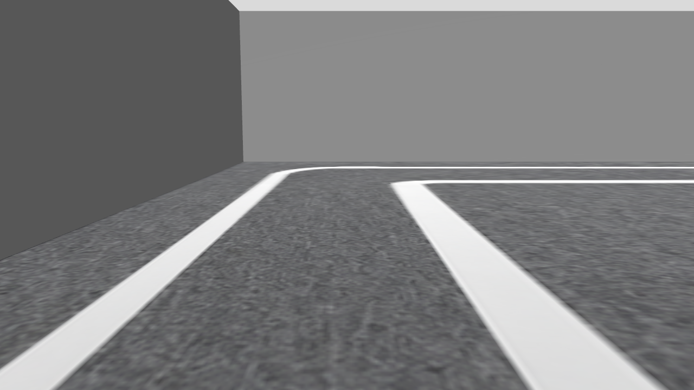
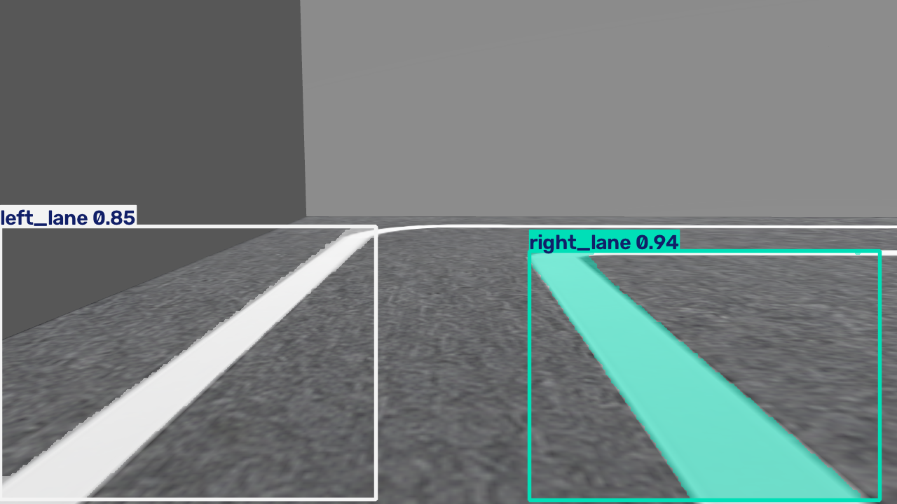
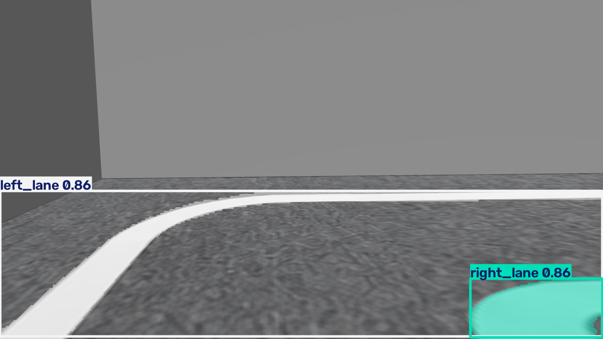

# Gazebo 실제 실행 기록

2026-10-08, ROS Jazzy / Gazebo 8.15.0 / CPU Mesa 렌더링.
실제 Gazebo 센서 영상이며 개념도나 생성 이미지 미리보기가 아니다.

## 로봇 카메라

## PT 모델의 차선 검출 및 주행

- [센서·cmd_vel 검사](smoke/result.json): 8.112cm 이동, 정지 drift 0m.
- [PT / NCNN 저장 영상 추론](inference/result.json): 두 export 모두 좌우 차선 검출.
- [PT 기본 차선 추종](lane-pt/result.json): 4 simulation seconds, 33 유효 프레임, 30.797cm 이동.

smoke 실행 뒤 같은 단일 월드의 로봇에서 주행 시험을 실행했다.
따라서 주행 시험 시작 위치는 최초 spawn 위치에서 약 8cm 이동한 위치다.
33 프레임은 전체 코스 완주 또는 인식 정확도 평가 데이터셋을 의미하지 않는다.
모델 가중치는 공개 저장소에 포함하지 않았다. 실행 방법과 제한은 [TEXTURE.md](../../TEXTURE.md)를 참고한다.
