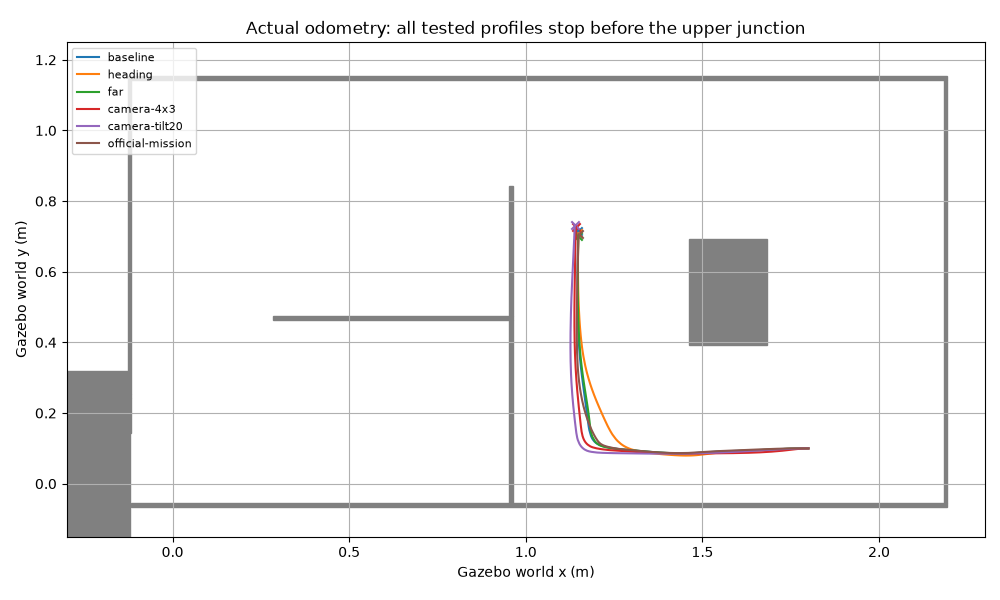

# 차선 유실 원인 비교와 공식 카메라 기준 후속 시험

2026-10-08. 사용자가 공식 모델 기준을 지정했으므로 최종 기본값은 **1280×720, tilt 8°**다.
PGM 벽·승인 PNG·YOLO 가중치·실물 autonomous/core/traffic 소스는 변경하지 않았다.
아래 비교는 같은 world와 spawn (1.80, 0.10, yaw=π)에서 전용 컨테이너를 재시작해 수행했다.

## 실제 주행 비교

| 설정 | odom 누적 경로 | 결과 |
|---|---:|---|
| 기존 설정 재현 | 1.213m | 지속 차선 유실 |
| 기울기 보정 0.6만 활성화 | 1.159m | 지속 차선 유실 |
| 먼 차선 보조만 활성화 | 1.198m | 지속 차선 유실 |
| 640×480 / 8° | 1.251m | 지속 차선 유실 |
| 640×480 / 20° | 1.278m | 지속 차선 유실 |
| 공식 카메라 + 기존 미션 메서드 연결 | 1.198m | 합류부 전환 조건 미충족, 지속 차선 유실 |

[수치 비교](comparison.json). 각 하위 디렉터리의 result.json은 프레임별 전체 기록이며,
first_lost_raw.png는 실제 Gazebo의 최초 차선 유실 원본 영상이다.



경로는 odom을 spawn 좌표와 yaw=π로 변환해 나타냈다. SLAM 결과가 아니다.
기울기·먼 차선 옵션만으로 개선되지 않았고, 영상 비율·각도 변경도 같은 합류부에서 실패했다.
소폭 거리 차이를 통계적으로 유의한 개선으로 해석하지 않는다. 각 비교 조건은 1회 실행이다.

## 원본 영상에서 확인한 검출 조건

기존 `AutonomousDriveNode._detect()`를 그대로 호출해 각 최초 유실 영상을 재분석했다.
[원본 검출 결과](original-detect-comparison.json).

- 공식 8° 영상에서 좌우 차선 마스크가 없었다. 화면 옆의 crosswalk는 검출되지만 중앙
  영역 조건에 맞지 않아 crosswalk_area=0이었다.
- YOLO 입력 크기를 320→640으로 높여도 같은 공식 카메라 유실 영상에서는 crosswalk만 검출됐다.
- 20°·4:3 영상에서는 cross_lane 폭이 0.990625로 검출됐다. 그러나 이는 비교 조건이며
  실물 장착 각도의 근거가 아니므로 기본 설정으로 채택하지 않았다.
- 별도 공식 카메라 미션 시험에서 cross_lane 폭 ≥0.60의 최장 연속 검출은 **1프레임**이었다.
  기존 조건은 **3프레임 연속**이므로 junction_latched가 켜지지 않았다.

따라서 현재 확인한 실패 경로는 **합류부에서 좌우 차선이 시야에서 사라짐 → 합류부 검출의
시간적 지속 조건도 충족하지 못함 → 상태는 driving에 남음 → 차선 유실 guard 정지**다.
생성 텍스처의 학습 데이터 적합성이나 실물과의 카메라 투영 차이까지 분리한 결론은 아니다.
사진 기반 텍스처 재보정 또는 실제 카메라 데이터와의 비교 없이 원인을 모델 하나로 단정할 수 없다.

## 이번 변경과 재현

- 카메라 width/height/tilt를 시뮬레이션 launch 인자로 노출했다. 기본값은 공식 모델 그대로다.
- 기존 LaneTracker의 heading/far 옵션을 비교용 CLI로 노출했다. 기본값은 기존 legacy 그대로다.
- 차선 유실이 2초 지속되면 정지 상태로 결과와 원본 영상을 저장하고 **실패 종료코드**를 반환한다.
  이전처럼 조금 움직였다는 이유만으로 긴 시험을 성공 처리하지 않는다.
- `--mission-states`는 기존 실물 메서드를 직접 호출한다. ROS 영상·odom·전방 LiDAR 입력을
  연결하며, 실물 Picamera2·초음파·LED·SLAM을 가짜로 성공 처리하지 않는다.
  이 모드는 명시적으로 **odom-only U턴 fallback** 검사다. 실제 입력에서도 아직 복귀에 도달하지 못했다.
- 원본 미션의 advance/turn 단계는 차선 추론 없이 동작하므로 이 단계에 lane guard를 요구하지 않는다.
  전방 LiDAR 0.12m 제한과 센서 중단 보호는 모든 단계에서 유지한다.

공식 카메라로 spawn:

```bash
ros2 launch pinky_fms_sim sim_robot.launch.xml namespace:=amr_01 \
  x:=1.80 y:=0.10 yaw:=3.14159 nav:=false \
  camera_width:=1280 camera_height:=720 camera_tilt:=8
```

같은 domain/partition의 새 월드·로봇에서 매 시험을 시작하고 ROS와 YOLO venv를 source한다:

```bash
ros2 run pinky_fms_sim sim_lane_follow.py --model /absolute/path/best.pt \
  --output /tmp/official-mission-NEW --duration 60 --wall-timeout 240 \
  --mission-states --drive
```

비교 시험에서는 `--mission-states`를 생략하고 `--heading-gain 0.6` 또는 `--far-fallback`을
하나씩 지정한다. 카메라 비교는 로봇을 새로 spawn해야 한다. 실행 중 파라미터 변경이 아니다.
실패를 피하려고 모델 confidence, 합류부 폭·연속 프레임 조건, 벽 geometry를 바꾸지 않았다.

## 남은 제한

전체 코스 완주와 실제 Gazebo에서의 횡단보도·출발점 복귀는 통과하지 않았다.
이 비교 결과는 완주 성공이 아니라 재현 가능한 실패 진단이다.
다음 데이터는 공식 카메라로 촬영한 동일 합류부 영상 또는 실측 camera_info·장착 높이·코스
차선 폭이다. 이 자료가 있으면 실물-시뮬레이션 투영 및 모델 검출 차이를 직접 비교할 수 있다.

## 최종 회귀 확인

- `colcon build --base-paths src --packages-select pinky_fms_sim`: 빌드 통과.
- 좌표·벽 보존 unittest 9개 통과.
- 제어된 입력 상태·어댑터 연결 검사 6개 통과. 물리 복귀 성공을 뜻하지 않는다.
- [공식 카메라 4초 기본 주행](final-smoke.json): 28/28 유효 프레임, 0.30706m 이동, guard stop 0.
- [설치된 미션 모듈의 2초 관찰](final-mission-observe.json): 13/13 유효 프레임, cmd_vel 비활성, 이동량 0.

공식 설정은 유지됐으며 긴 주행·전체 코스 실패를 해소했다고 주장하지 않는다.
