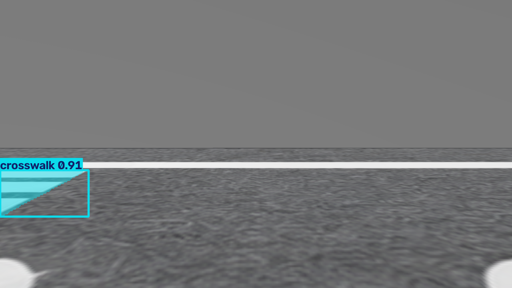

# 후속 검증: 전체 코스 미완주

2026-10-08. 기존 모델·기존 LaneTracker 설정으로 90 simulation seconds 실행했다.
보호 경로와 모델 가중치는 변경하지 않았다.

## 실제 Gazebo 주행 결과

- 누적 odom 경로 길이 1.18867m, 시작점 대비 변위 0.88303m.
- 594 프레임 중 BOTH 79, SINGLE 27, LOST 488.
- 첫 차선 유실: world sim stamp 20.396s (시험 시작 약 15.8초 후).
- 첫 유실 시 전방 LiDAR 최소 거리 0.52584m. 0.12m 거리 guard가 아니라 차선 유실로 정지했다.
- 그 이후 시험 종료까지 차선 추적이 회복되지 않아 **전체 코스 미완주**로 판정한다.
- crosswalk는 500프레임, cross_lane은 1프레임에 검출됐다. 검출만으로 횡단보도 상태 처리나 복귀를 검증한 것은 아니다.



[전체 기록](result.json) / [집계와 최초 정지 기록](assessment.json)

실행 명령(ROS와 workspace 및 YOLO venv를 source하고 domain91/동일 Gazebo partition 사용):

```bash
ros2 run pinky_fms_sim sim_lane_follow.py --model /ws/lane_model_ncnn/best.pt \
  --output /tmp/lane-extended-001 --duration 90 --wall-timeout 900 --drive
```

기존 adapter의 종료코드 0은 유효 프레임 3개 이상과 이동량 3cm 이상이라는 기본 smoke
기준만 뜻한다. 완주 판정은 하지 않으므로 이번 시험을 성공으로 해석하지 않는다.
또한 adapter는 차선 유실 즉시 정지하므로 실물 노드의 전체 행동과 동일하다고 주장하지 않는다.
현재 영상에서는 좌우 차선이 검출되지 않고 횡단보도만 검출된다. 생성 텍스처·카메라 시야·
코너 조향의 영향은 추가 비교가 필요하며, 한 가지를 근본 원인으로 확정하지 않았다.

## 횡단보도·복귀 상태 로직 검사

`tests/check_autonomous_states.py`는 변경하지 않은 AutonomousDriveNode 메서드를 직접
호출한다. 거리·시각·위치·검출 측정값은 **제어된 테스트 입력**이며 실제 센서 측정값이 아니다.

1. 횡단보도 접근 감속 → 물체 없음 1.5초 확인 → 정속 복귀·재감지 준비.
2. 횡단보도 물체 감지 → 정지 → 물체 제거 후 재출발.
3. 장애물이 6초 넘게 유지되면 횡단보도 정지를 해제하고 일반 감속으로 전환하는 기존 정책.
4. 갈림길 확정 → 전진 → 정지 → odom 기반 U턴 fallback → 추종 → 출발점 근처 HOME 정지.
5. 출발점 정보가 없으면 RETURN_FAILED 정지.

5개 통과. [실행 로그](autonomous-states.log).
ROS workspace와 YOLO venv를 source한 뒤 다음으로 재현한다:

```bash
python tests/check_autonomous_states.py
```

이 검사는 실제 카메라 기반 횡단보도 통과, map 기반 경로 선택, SLAM 정확도,
실제 초음파 동작 또는 Gazebo 출발점 복귀의 종단간 성공을 의미하지 않는다.
현재 simulation adapter는 기본 차선 추종만 연결하므로 전체 상태 머신의 종단간 검증은 남아 있다.
보호된 실물 코드를 변경하거나 가짜 센서 성공값으로 우회하지 않았다.

## 클라우드 게시·복원 확인

설정 읽기에서 base_version_id가 이전 `cecfgver_6ac641fd2fbc81959e7bbfd80df17573`에서
`cecfgver_6ac6ec3428dc8195bd4e1b01e5fd315e`로 변경됐다.
미게시 draft_id/revision은 null이며 저장한 simulation 시작 지침이 유지되어 있다.
복원된 tg-gazebo-course-runtime 컨테이너와 모델·ROS 빌드 결과를 확인하고 컨테이너를
시작해 위 실제 Gazebo 시험을 실행했다. 프로세스 자체는 게시 후 재시작이 필요했다.
따라서 새 구성 게시와 이번 환경의 복원·재실행은 확인됐다.
